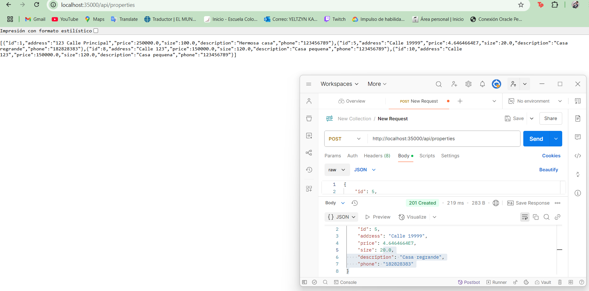

# **Create a CRUD System to Manage Propertiess**

## **Resumen del Proyecto**

 **frontend** desarrollado en HTML, CSS y JavaScript.
   **backend** construido con **Spring Boot** y MySQL para la persistencia de datos.
  **base de datos** alojada en AWS EC2 utilizando MySQL.


# Proyecto 
El Property Management System es una aplicación web que permite gestionar propiedades mediante operaciones CRUD (Crear, Leer, Actualizar, Eliminar). Los usuarios pueden registrar propiedades con detalles como dirección, precio, tamaño, descripción y teléfono.

## Objetivo:
Crear nuevos listados de propiedades.
Leer o ver una lista de todas las propiedades y detalles de propiedades individuales.
Actualizar detalles de propiedades existentes.
Eliminar listados de propiedades.
Requisitos:
Interfaz de usuario (HTML + JavaScript):

Crear una interfaz de usuario simple con formularios para capturar información de propiedades (por ejemplo, dirección, precio, tamaño, descripción).
Mostrar una lista de todas las propiedades con opciones para ver, actualizar y eliminar cada una.
Implementar la validación del lado del cliente (por ejemplo, campos obligatorios, tipos de datos válidos).
Usar AJAX o Fetch API para comunicarse con los servicios REST del backend.
Backend (API REST de Spring Boot):

Desarrollar puntos finales RESTful para cada operación CRUD:
POST para crear una nueva propiedad.
GET para recuperar todas las propiedades o una sola propiedad por ID.
PUT para actualizar una propiedad existente.
DELETE para eliminar una propiedad por ID.
Manejar errores como entradas no válidas o solicitudes de propiedades inexistentes.
Asegúrese de que cada propiedad tenga los siguientes atributos:
ID de la propiedad (generada automáticamente)
Dirección
Precio
Tamaño
Descripción
Base de datos (MySQL):

Cree una tabla de propiedades con columnas para ID, dirección, precio, tamaño y descripción.
Use JPA/Hibernate para asignar los objetos de propiedad a la base de datos.
Implemente la persistencia de datos para todas las operaciones CRUD.
4. Los servicios de backend y la base de datos deben implementarse en servidores separados en AWS.


 

## Arquitectura
```Bash
AREP-TALLER05/
│── src/
│   ├── main/
│   │   ├── java/
│   │   │   ├── com/edu/eci/arep/arep_taller05/Contoller
│   │   │   │   ├── PropertyController.java
│   │   │   ├── com/edu/eci/arep/arep_taller05/Model
│   │   │   │   ├── Property.java
│   │   │   ├── com/edu/eci/arep/arep_taller05/Repository
│   │   │   │   ├── PropertyRepository.java
│   │   │   ├── com/edu/eci/arep/arep_taller05/Service
│   │   │   │   ├── PropertyService.java
│   │   │   ├── ApplicationProperty.java
│   ├── resources/
│   │   ├── img
│   │   ├── static
│   │   │   │── style.css
│   │   │   │── script.js
│   │   │   ├── index.html
│   │   ├── application.properties
│── pom.xml
│── README.md
│── Dockerfile
│── docker-compose.yml
```

La arquitectura del sistema sigue un modelo en tres capas:

- **Frontend:** Aplicación web estática (HTML, CSS, JavaScript) alojada en el servidor y comunicándose con el backend mediante llamadas REST.
- **Backend:** API REST desarrollada en Java con Spring Boot, que expone servicios para la gestión de propiedades.
- **Base de Datos:** MySQL, con JPA/Hibernate para la persistencia de datos.

### Flujo de interacción:
1. El frontend envía solicitudes HTTP al backend.
2. El backend procesa las solicitudes y consulta la base de datos.
3. La respuesta se devuelve al frontend para ser mostrada en la UI.

## Class Design

### **1. Modelo de Datos**
- `Property`: Entidad que representa una propiedad con los atributos:
  - `id`
  - `address`
  - `price`
  - `size`
  - `description`
  - `phone`

### **2. Capa de Persistencia**
- `PropertyRepository`: Interfaz que extiende `JpaRepository`, permitiendo operaciones CRUD sobre la base de datos.

### **3. Capa de Servicio**
- `PropertyService`: Contiene la lógica de negocio y métodos para manejar propiedades.

### **4. Capa de Controlador**
- `PropertyController`: Expone los endpoints REST para interactuar con las propiedades.

## **Instalación** 

1. Descarga el repositorio remoto a tu local
    
    ```
    git clone https://github.com/YeltzynS/AREP_TALLER05.git
    
    ```
    
2. Entra en el directorio.
    
    ```
    cd AREP_TALLER05
    ```
    
3. Compila el proyecto:
    
    `mvn clean install`
   

## SCREENSHOOTS: 📷
#### Final work:
- GET


- POST


- PUT


- DELETE


### **Conexión mysql**

1. Crear la instancia con mysql.
2. Conectarse por SSH:
    
    ``` bash
    ssh -i "myfirstkey.pem" ec2-user@<instance-ip>
    ```
    
3. Instala docker y corre mysql:
    
    ``` bash
    sudo yum update -y
    sudo yum install docker -y
    sudo usermod -a -G docker ec2-user
    docker run --name contenedor_mysql -e MYSQL_ROOT_PASSWORD=root -e MYSQL_DATABASE=properties_db -p 3306:3306 -d mysql:latest
    ```
  

4. Ver que se creo la tabla:

   
   


### **Backend**

1. Crear el dockerfile
Usar una imagen base de Java 17
FROM openjdk:17-jdk-alpine
WORKDIR /app
EXPOSE 35000
Comando para ejecutar la aplicación
ENTRYPOINT ["java", "-jar", "app.jar"]

2. Par los paquetes de la aplicación
   
    ``` bash
    mvn clean package
    ```

3. Construimos la imagen:

    ``` bash
    docker build -t app .
    ```
4. Agregamos el tag de docker y cargamos el repositorio de dockerhub
   
    ``` bash
    docker tag app yeltzyns/app
    ```

    ``` bash
    docker push <your-dockerhub-username>/property-app
    ```
    
#### AWS:
1.Lanzamos la instancia para el backend.
2. Nos conectamos por SSh:
    
    ``` bash
    ssh -i "myfrist.key.pem" ec2-user@<instance-ip>
    ```
    
3. Intslamos docker y traemos la imagen del repositorio:
    
    ``` bash
    sudo yum update -y
    sudo yum install docker -y
    sudo service docker start
    docker pull yeltzyns/app
    ```
    
  4. Corremos el backen:
    
    ``` bash
    docker run -d -p 35000:35000 --name app yeltzyns/app
    ```
## **Aplicación Funcionando graficamente**


      


## **Video Funcionando**
[](https://youtu.be/dwiVE1yXyfg)

---
## Corriendo los test 

Utiliza este comando para correr los test:

```
mvn test
```


### Construido Con
Java: El lenguaje de programación utilizado.

Maven: Herramienta de gestión de dependencias y construcción.

JUnit: Framework de pruebas.

Docker: Herramienta de contenedorización.

### Author
- Yeltzyn Sierra
  
### License
This project is licensed under the MIT license: see the LICENSE.md file for details.
